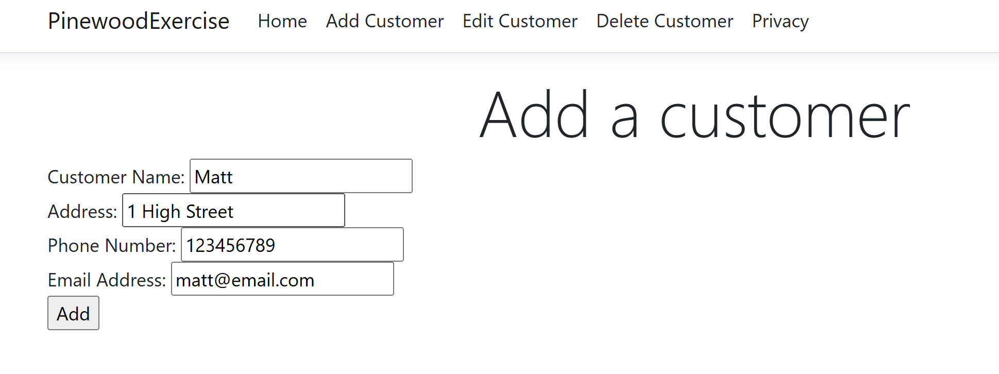
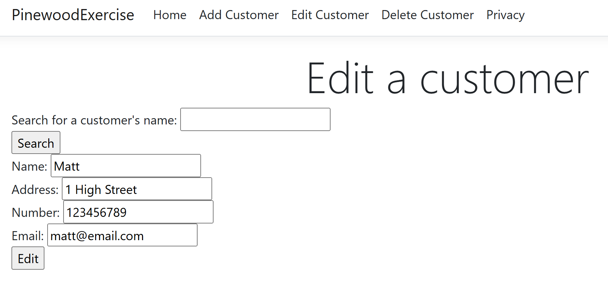
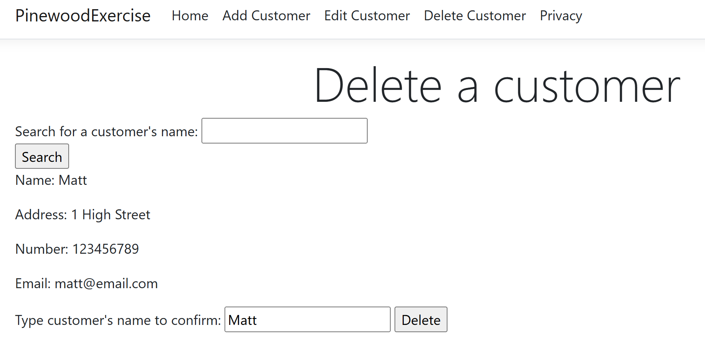
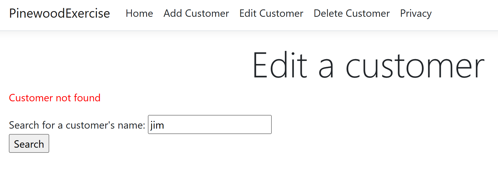

# Pinewood Exercise

I've made an ASP.NET project with Razor Pages.
I've made a Customer class for customer objects and have a global CustomerList to mock a database.

These are the pages I've created:

- Add customer
  - The user can add a customer by entering their name, address, email, and phone number
- Edit customer
  - The user searches for a customer by name then can edit the customer's details (excluding the name)
- Delete customer
  - The user searches for a customer by name then can delete the customer

I've also added some basic error handling.
If I spent more time on this, I would add more error handling/validation and improve the UI.

I would also think about how I can make the delete and edit functionality more robust. I would look into how objects are stored in the .cshtml.cs file so I can reuse the object from the initial search query rather than having to find the customer by name again.

I haven't used ASP.NET or Razor Pages before so this has been an interesting exercise. I've used the following resources to help me:

- Visual Studio templates
- Microsoft documentation
- Stack Overflow
- GitHub Copilot

Screenshots of application:

